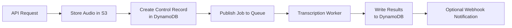
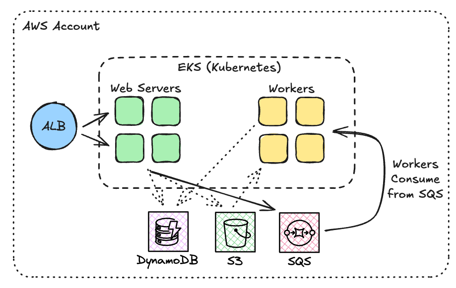

## Part B — Voice-to-Text System Architecture

### 1. High-Level Architecture

- Transcription should run **asynchronously** to support high throughput and avoid blocking API latency.
- Using a separate microservice does **not** inherently increase scalability, but it improves code isolation, maintainability, and deploy independence. Scalability is achieved primarily through asynchronous, horizontally scalable workers.
- Proposed data flow:
  1. API receives a POST request containing the audio file.
  2. Raw audio is stored in an object storage service (e.g., S3). In the take-home implementation this was done through a local storage adapter.
  3. A control record is written into a scalable database (e.g., DynamoDB) to track status, input metadata, and future results.
  4. An asynchronous command/job is published to a queue (e.g., RabbitMQ, or cloud-native SQS/PubSub).
  5. One of the transcription workers consumes the job, retrieves the audio from storage, and performs the transcription.
  6. Transcription results (status, text, errors, timestamps) are persisted back into the control table.
  7. Optionally, the system triggers a webhook notification to the requester.

---

### 2. Model/Provider Selection

Transcription provider selection is a **multi-objective trade-off** involving cost, robustness, operational complexity, and time-to-market.

**Self-hosted model (e.g., Whisper on GPU instances):**
- **Pros**
  - Lower cost at scale; we can batch multiple audio jobs and run inference on a GPU worker with efficient padding/packing strategies.
  - Ability to fine-tune models or build domain-specific datasets for higher accuracy in our target environment.
- **Cons**
  - Increased operational complexity (autoscaling GPU nodes, model deployment, versioning).
  - Longer initial development and maintenance cycles.

**External managed provider (e.g., OpenAI Whisper API, Deepgram):**
- **Pros**
  - Zero infrastructure overhead; robustness and uptime delegated to the vendor.
  - Model updates require only a configuration change—no redeployment.
- **Cons**
  - Higher recurring cost, especially for large volumes.
  - Vendor lock-in and less control over domain adaptation.

**Provider switching strategy:**
- Abstract transcription behind a `TranscriptionService` interface.
- Maintain configuration-driven provider selection.
- Normalize input/output formats to ensure that switching engines requires minimal code changes.

---

### 3. Performance Considerations

- Latency for this specific product does not need to be near real time; a delay of several seconds is acceptable since transcripts are consumed after the fact by administrators.
- Throughput can be stabilized using a Kubernetes cluster with autoscaled workers pulling jobs from the queue.
- GPU vs CPU:
  - **GPU** for self-hosted Whisper when optimizing throughput and cost per second of audio.
  - **CPU** is acceptable only for low-volume or non-time-sensitive workloads.
- For self-hosted deployments:
  - Use batching and right-padding audio chunks to maximize GPU utilization.
  - Chunking/streaming is not necessary for this product as full-file processing is simpler and sufficient.

---

### 4. Scalability Strategy

- Use Kubernetes Horizontal Pod Autoscaling (HPA) driven by CPU, memory, or custom metrics (e.g., queue depth, job processing time).
- Worker model:
  - Stateless workers running one or multiple inference jobs in parallel.
  - Workers scale horizontally according to backlog.
- Queue selection:
  - Could be RabbitMQ for internal setups.
  - For cloud-first architectures, SQS or Pub/Sub improves durability and simplifies multi-region setups.
- Multi-region considerations:
  - Queue + storage + compute must be regionally aligned.
  - Optional for v1, valuable for high availability.

---

### 5. Observability

- Logs:
  - Capture worker execution logs, errors, timeouts, and retry attempts.
  - Use Datadog or centralized ELK/OpenSearch stack via FluentBit.
- Metrics:
  - Per-worker average latency, max latency, jobs/sec.
  - Error rate, retry count, dead-letter queue size.
  - Queue depth and worker saturation.
- Dashboards:
  - Grafana/Datadog dashboards for real-time health and load.
- Drift/degradation detection:
  - For self-hosted models: track distribution shifts between input features and output transcriptions over time.
  - Implement a user/admin feedback loop to evaluate perceived transcription quality.
  - Fully automated drift detection without labels signals that “something changed,” but not whether accuracy improved or degraded.

---

### 6. Failure Handling and Degraded Modes

- Use retry mechanisms with exponential backoff.
- After max retries, push the task to a **dead-letter queue (DLQ)**.
- A background process periodically inspects DLQ items and classifies them as:
  - recoverable (retry later),
  - permanently corrupted (e.g., invalid audio).
- Implement a circuit breaker:
  - If the transcription provider or model enters a failure state, temporarily route all jobs directly to DLQ to avoid system collapse.
- Provide a degraded mode:
  - API still accepts uploads.
  - Users get a “processing delayed” message rather than a generic failure.

---

### 7. Security and Compliance

- Store audio in S3 with **encryption at rest** (SSE-S3 or SSE-KMS) and enforce **TLS in transit**.
- Configure lifecycle policies and retention windows based on business/legal requirements.
- Ensure IAM roles follow the principle of least privilege; workers must only access the specific buckets/prefixes they need.
- Support recursive deletion of data if a user requests removal (GDPR/LGPD-style compliance).
- Prohibit long-lived static credentials; use role-based access with rotation and temporary tokens.
- Validate and sanitize metadata since audio may contain PII or sensitive information.

---

## Part C — Optional Architecture Sketch

### Simplified pipeline

### AWS example

---

